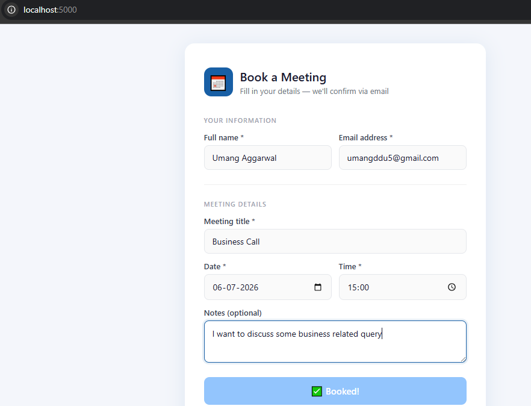
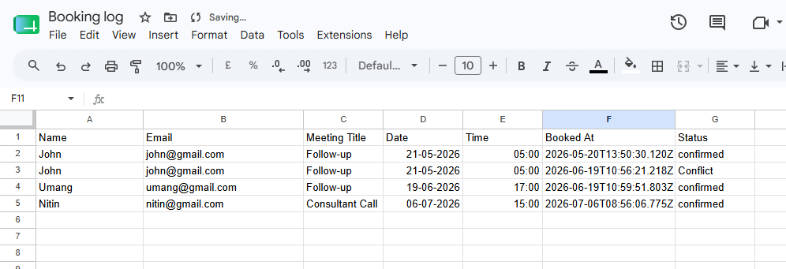
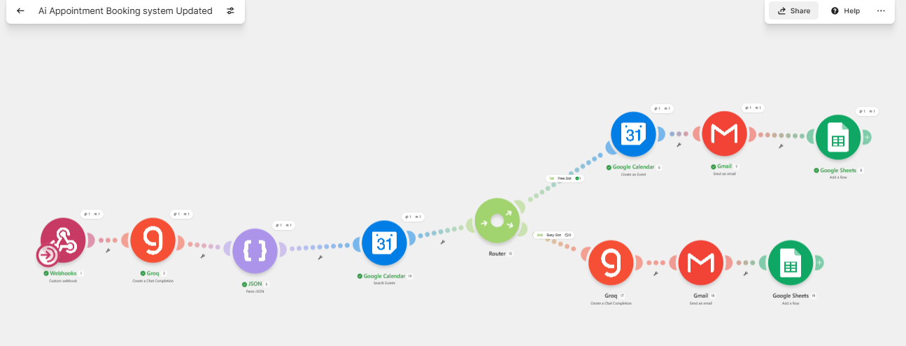

# 🤖 AI Appointment Booking System

An AI-powered appointment scheduling system that automates meeting booking, conflict detection, calendar management, email notifications, and booking logs using Flask, Make.com, Groq LLM, Google Calendar, Gmail, and Google Sheets.

---

## 🚀 Features

✅ User-friendly appointment booking interface

✅ AI-powered appointment processing using Groq LLM

✅ Automatic Google Calendar event creation

✅ Smart conflict detection before booking

✅ AI-generated alternative meeting slots

✅ Automatic confirmation email

✅ Google Meet link generation

✅ Booking log stored in Google Sheets

✅ Backend webhook security using Flask

---

# 🛠 Tech Stack

### Backend

- Python
- Flask
- Flask-CORS
- Requests

### Frontend

- HTML
- CSS
- JavaScript

### AI

- Groq API
- Llama 3.3 70B Versatile

### Automation

- Make.com
- Webhooks
- JSON Parser

### Google Services

- Google Calendar API
- Gmail
- Google Sheets

---

# 📂 Project Structure

AI-Appointment-Booking-System

├── automation/
│   └── AI Appointment Booking system.blueprint.json

├── docs/
│   ├── booking-form-demo.png
│   ├── booking-log-sample.png
│   └── workflow-diagram.png

├── templates/
│   └── index.html

├── app.py
├── requirements.txt
├── .env.example
├── .gitignore
└── README.md

---

# ⚙ Workflow

1. User submits appointment details.
2. Flask receives the request.
3. Flask securely sends data to a Make.com webhook.
4. Groq AI converts the request into structured appointment data.
5. Google Calendar checks for scheduling conflicts.
6. If the slot is available:
   - Create Calendar Event
   - Generate Google Meet Link
   - Send Confirmation Email
   - Store booking in Google Sheets
7. If the slot is occupied:
   - Groq AI suggests three alternative meeting times.
   - User receives an email with alternative slots.

---

# 🧠 System Architecture

User

↓

Flask Backend

↓

Make Webhook

↓

Groq AI

↓

Google Calendar

↓

Router

↙                     ↘

Available           Conflict

↓                         ↓

Calendar Event      AI Suggestion

↓                         ↓

Gmail               Gmail

↓

Google Sheets

---

# 📷 Screenshots

## Booking Form



---

## Booking Log



---

## Make.com Workflow



---

# 🚀 Installation

## Clone Repository

```bash
git clone https://github.com/umangaggarwal55/AI-Appointment-Booking-System.git

cd AI-Appointment-Booking-System
```

## Create Virtual Environment

```bash
python -m venv venv
```

Windows

```bash
venv\Scripts\activate
```

Linux / macOS

```bash
source venv/bin/activate
```

Install dependencies

```bash
pip install -r requirements.txt
```

Create .env

```env
MAKE_WEBHOOK_URL=YOUR_MAKE_WEBHOOK_URL
```

Run

```bash
python app.py
```

Open

```
http://localhost:5000
```

---

# 📄 Make.com Blueprint

The complete Make.com automation blueprint is available in

```
automation/
```

Import it directly into Make.com to recreate the workflow.

---

# 🔒 Security

Sensitive credentials are never committed.

Ignored files

```
.env
```

Only

```
.env.example
```

is included.

---

# 🔮 Future Improvements

- Authentication
- Admin Dashboard
- MongoDB Integration
- Appointment Cancellation
- Rescheduling
- SMS Notifications
- Zoom & Microsoft Teams Integration
- Docker Deployment
- CI/CD Pipeline
- Voice AI Booking Assistant

---

# 👨‍💻 Author

**Umang Aggarwal**

Python Developer • AI/ML Engineer • Workflow Automation Enthusiast

LinkedIn

https://linkedin.com/in/umang-aggarwal55

GitHub

https://github.com/umangaggarwal55

---

## ⭐ If you found this project useful, consider giving it a Star.
